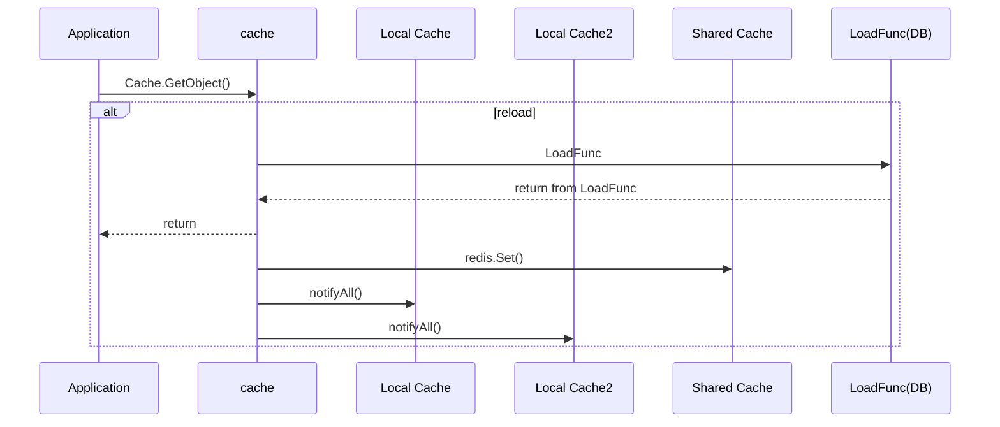
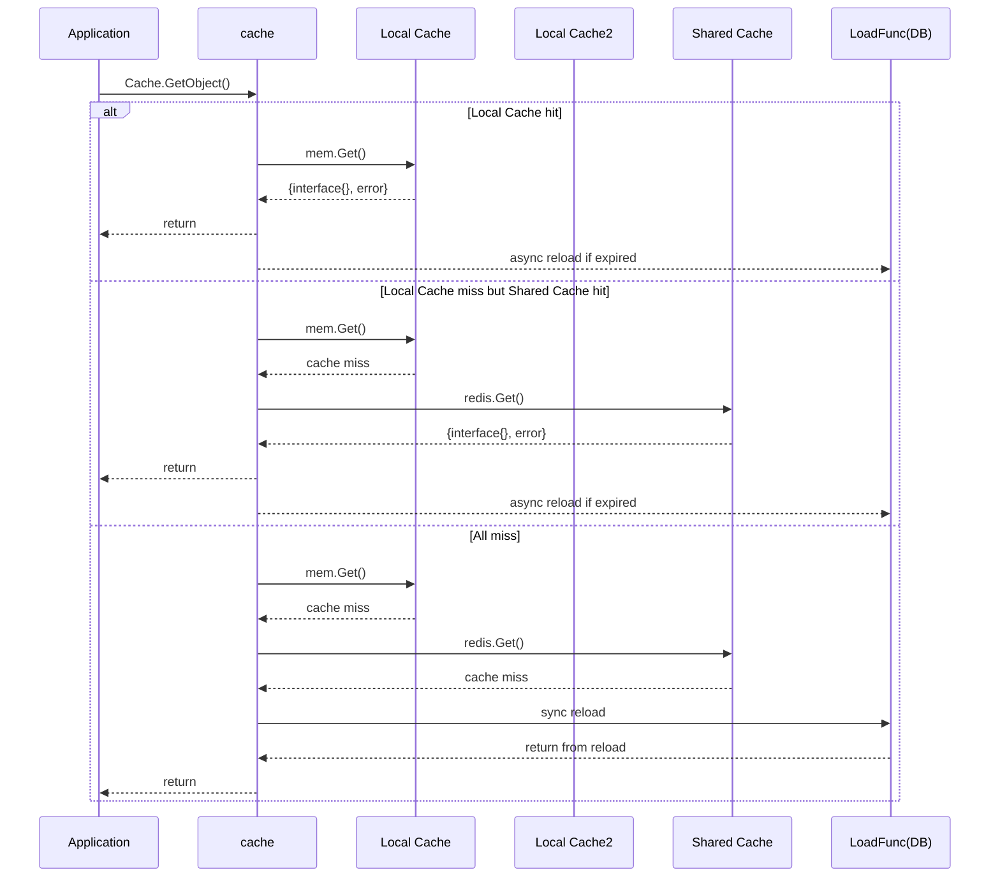
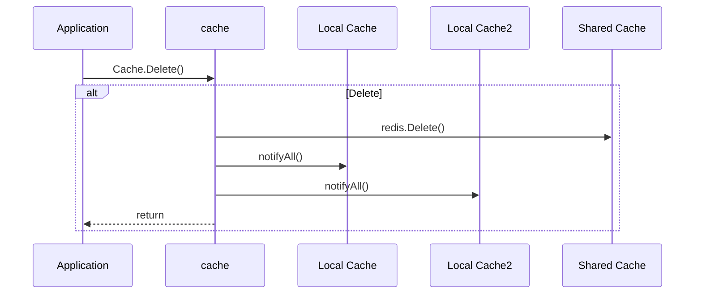

# cache

This is a high-performance, lightweight distributed caching solution that implements the cache-aside pattern, built upon a combination of in-memory and Redis. The cache architecture includes a singular global Redis instance and multiple in-memory instances. Data changes can be synchronized across all in-memory cache instances depending on the cache update policy.

The library's design gives priority to data retrieval from the in-memory cache first. If the data isn't found in the local memory cache, it then resorts to the Redis cache. Should the data be unavailable in both caches, the library invokes a loader function to fetch the data, storing it in the cache for future access, thus ensuring an always-on cache.


## Features

- **Two-level cache** : in-memory cache first, redis-backed
- **Easy to use** : simple api with minimum configuration.
- **Data consistency** : all in-memory instances will be notified by `Pub-Sub`
  if any value gets deleted, other in-memory instances will update.
- **Concurrency**: singleflight is used to avoid cache breakdown.
- **Metrics** : provide callback function to measure the cache metrics.

## Sequence diagram

### cache get policy
 - GetPolicyReturnExpired: return found object even if it has expired.
 - GetPolicyReloadOnExpiry: reload object if found object has expired, then return.


The below sequence diagrams have GetPolicyReturnExpired + UpdatePolicyBroadcast.

### Reload from loader function



### Cache GetObject




### Delete



### Installation

`go get -u github.com/seaguest/cache`

### API

#### Production Interface
```go
type Cache interface {
    // GetObject loader function f() will be called in case cache all miss
    // suggest to use object_type#id as key or any other pattern which can easily extract object, aggregate metric for same object in onMetric
    GetObject(ctx context.Context, key string, obj any, ttl time.Duration, f func() (any, error), opts ...Option) error
    
    Delete(ctx context.Context, key string) error
}
```

The `New()` function returns a `Cache` interface:

```go
func New(options ...Option) Cache
```

#### Testing Support

For testing purposes, additional functionality is available through `NewForTesting()`:

```go
func NewForTesting(options ...Option) (*Testing, Cache)
```

The `Testing` struct provides methods to manipulate cache state for testing:

```go
type Testing struct {
    // DeleteFromMem allows to delete key from mem, for test purpose
    func (t *Testing) DeleteFromMem(key string)
    // DeleteFromRedis allows to delete key from redis, for test purpose
    func (t *Testing) DeleteFromRedis(key string) error
}
```

### Tips

`github.com/seaguest/deepcopy`is adopted for deepcopy, returned value is deepcopied to avoid dirty data.
please implement DeepCopy interface if you encounter deepcopy performance trouble.

```go
func (p *TestStruct) DeepCopy() interface{} {
	c := *p
	return &c
}
```

### Usage

#### Production Usage
```go
package main

import (
	"context"
	"fmt"
	"log"
	"time"

	"github.com/gomodule/redigo/redis"
	"github.com/seaguest/cache"
)

type TestStruct struct {
	Name string
}

// this will be called by deepcopy to improve reflect copy performance
func (p *TestStruct) DeepCopy() interface{} {
	c := *p
	return &c
}

func main() {
	pool := &redis.Pool{
		MaxIdle:     1000,
		MaxActive:   1000,
		Wait:        true,
		IdleTimeout: 240 * time.Second,
		TestOnBorrow: func(c redis.Conn, t time.Time) error {
			_, err := c.Do("PING")
			return err
		},
		Dial: func() (redis.Conn, error) {
			return redis.Dial("tcp", "127.0.0.1:6379")
		},
	}

	// Production code uses Cache interface
	var c cache.Cache = cache.New(
		cache.GetConn(pool.Get),
		cache.GetPolicy(cache.GetPolicyReturnExpired),
		cache.Separator("#"),
		cache.OnMetric(func(key, objectType string, metricType string, count int, elapsedTime time.Duration) {
			// handle metric
		}),
		cache.OnError(func(ctx context.Context, err error) {
			// handle error
		}),
	)

	ctx, cancel := context.WithTimeout(context.Background(), time.Second*2)
	defer cancel()

	var v TestStruct
	err := c.GetObject(ctx, fmt.Sprintf("TestStruct#%d", 100), &v, time.Second*3, func() (any, error) {
		// data fetch logic to be done here
		time.Sleep(time.Millisecond * 1200)
		return &TestStruct{Name: "test"}, nil
	})
	log.Println(v, err)
}
```

#### Testing Usage
```go
package mypackage_test

import (
	"context"
	"testing"
	"time"

	"github.com/gomodule/redigo/redis"
	"github.com/seaguest/cache"
)

func TestCacheOperations(t *testing.T) {
	pool := &redis.Pool{
		MaxIdle:     10,
		MaxActive:   50,
		Wait:        true,
		IdleTimeout: 240 * time.Second,
		Dial: func() (redis.Conn, error) {
			return redis.Dial("tcp", "127.0.0.1:6379")
		},
	}

	// Use NewForTesting to get both testing helper and cache
	tester, c := cache.NewForTesting(
		cache.GetConn(pool.Get),
		cache.Separator("#"),
		cache.OnError(func(ctx context.Context, err error) {
			t.Logf("Cache error: %+v", err)
		}),
	)
	
	// Clean up cache for testing
	tester.DeleteFromRedis("test-key")
	tester.DeleteFromMem("test-key")
	
	// Test cache functionality
	var result string
	err := c.GetObject(context.Background(), "test-key", &result, time.Minute, func() (any, error) {
		return "test-value", nil
	})
	if err != nil {
		t.Fatal(err)
	}
	
	if result != "test-value" {
		t.Errorf("Expected 'test-value', got '%s'", result)
	}
}
```